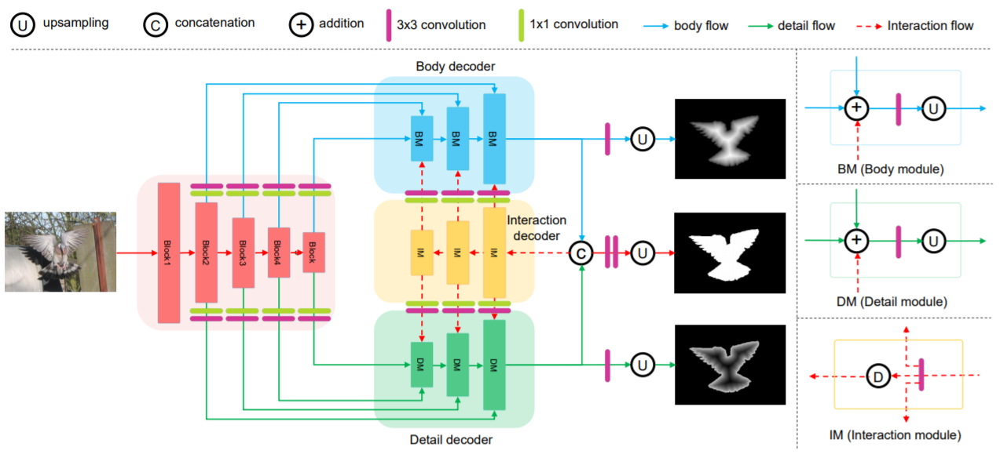
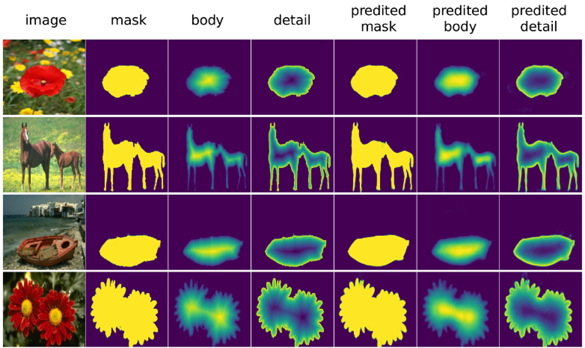
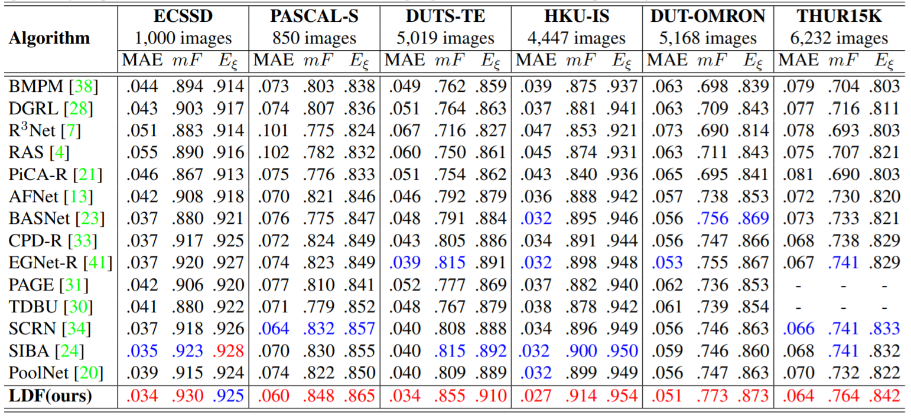
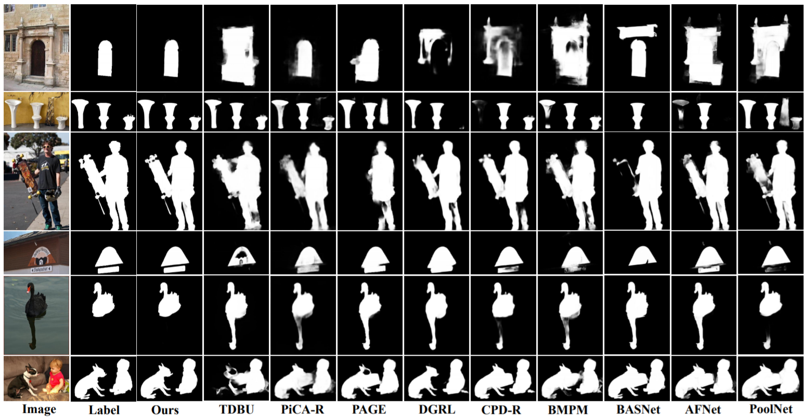

## [Label Decoupling Framework for Salient Object Detection](https://arxiv.org/pdf/2008.11048.pdf)
by Jun Wei, Shuhui Wang, Zhe Wu, Chi Su, Qingming Huang, Qi Tian

## Introduction
 To get more accurate saliency maps, recent methods mainly focus on aggregating multi-level features from fully convolutional network (FCN) and introducing edge information as auxiliary supervision. Though remarkable progress has been achieved, we observe that the closer the pixel is to the edge, the more difficult it is to be predicted, because edge pixels have a very imbalance distribution. To address this problem, we propose a label decoupling framework (LDF) which consists of a label decoupling (LD) procedure and a feature interaction network (FIN). LD explicitly decomposes the original saliency map into body map and detail map, where body map concentrates on center areas of objects and detail map focuses on regions around edges. Detail map works better because it involves much more pixels than traditional edge supervision. Different from saliency map, body map discards edge pixels and only pays attention to center areas. This successfully avoids the distraction from edge pixels during training. Therefore, we employ two branches in FIN to deal with body map and detail map respectively. Feature interaction (FI) is designed to fuse the two complementary branches to predict the saliency map, which is then used to refine the two branches again. This iterative refinement is helpful for learning better representations and more precise saliency maps. Comprehensive experiments on six benchmark datasets demonstrate that LDF outperforms state-of-the-art approaches on different evaluation metrics.

## Prerequisites
- [Python 3.5](https://www.python.org/)
- [Pytorch 1.3](http://pytorch.org/)
- [OpenCV 4.0](https://opencv.org/)
- [Numpy 1.15](https://numpy.org/)
- [TensorboardX](https://github.com/lanpa/tensorboardX)
- [Apex](https://github.com/NVIDIA/apex)


## Clone repository
```shell
git clone https://github.com/weijun88/LDF.git
cd LDF/
```

## Download dataset
Download the following datasets and unzip them into `data` folder

- [PASCAL-S](http://cbi.gatech.edu/salobj/)
- [ECSSD](http://www.cse.cuhk.edu.hk/leojia/projects/hsaliency/dataset.html)
- [HKU-IS](https://i.cs.hku.hk/~gbli/deep_saliency.html)
- [DUT-OMRON](http://saliencydetection.net/dut-omron/)
- [DUTS](http://saliencydetection.net/duts/)
- [THUR15K](https://mmcheng.net/mftp/Data/THUR15000.zip)

## Training & Evaluation
- If you want to train the model by yourself, please download the [pretrained model](https://download.pytorch.org/models/resnet50-19c8e357.pth) into `res` folder
- Split the ground truth into body map and detail map, which will be saved into `data/DUTS/body-origin` and `data/DUTS/detail-origin`
```shell
    python3 utils.py
```
- Train the model and get the predicted body and detail maps, which will be saved into `data/DUTS/body` and `data/DUTS/detail`
```shell
    cd train-coarse/
    python3 train.py
    python3 test.py
```
- Use above predicted maps to train the model again and predict final saliency maps, which will be saved into `eval/maps/LDF` folder.
```shell
    cd /train-fine/
    python3 train.py
    python3 test.py
```
- Evaluate the predicted results. 
```shell
    cd eval
    matlab
    main
```
- Training twice is to get smoother body and detail maps, as shown in following figure
 

## Testing & Evaluate
- If you just want to evaluate the performance of LDF without training, please download our trained model into `train-fine/out` folder
- Predict the saliency maps
```shell
    cd train-fine
    python3 test.py
```
- Evaluate the predicted results
```shell
    cd eval
    matlab
    main
```

## Saliency maps & Trained model
- saliency maps: [Google](https://drive.google.com/file/d/1GGZG1VnXRAcILOoxb5VnVgJxZ9MnRG2v/view?usp=sharing) | [Baidu 提取码:pb7i](https://pan.baidu.com/s/1QzTTKMcnxBFewcFfnuypGw) 
- trained model: [Google](https://drive.google.com/file/d/1qGQ6wSWTFqt8oy_YT3_aj-_pdlf5vKWL/view?usp=sharing) | [Baidu 提取码:sncf](https://pan.baidu.com/s/1ArIiABlDxoEdIdOn-kNqMg)
- Quantitative comparisons 


- Qualitative comparisons 


## Citation
- If you find this work is helpful, please cite our paper
```
@InProceedings{CVPR2020_LDF,
    author    = {Wei, Jun and Wang, Shuhui and Wu, Zhe and Su, Chi and Huang, Qingming and Tian, Qi},
    title     = {Label Decoupling Framework for Salient Object Detection},
    booktitle = {IEEE/CVF Conference on Computer Vision and Pattern Recognition (CVPR)},
    month     = {June},
    year      = {2020}
}
```
